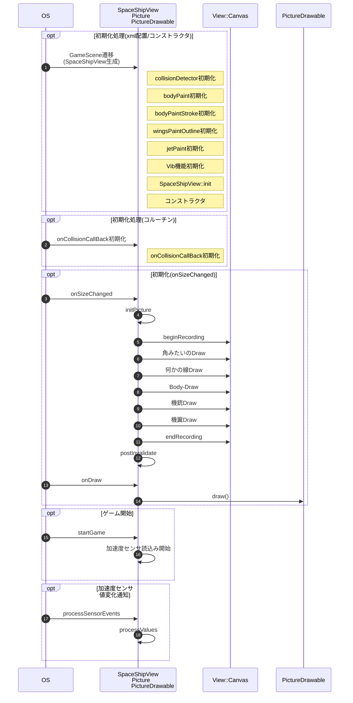

# AndKotlin-Invader
Android Kotlinで作成したInvaderゲーム

## GameSceneのシーケンス

### 1.SpaceShipViewのシーケンス

```mermaid
%% SpaceShipViewのシーケンス
sequenceDiagram
    autonumber
    participant OS
    participant SpaceShipView as SpaceShipView<br/>　Picture<br/>　　　　　PictureDrawable

opt 初期化処理(xml配置/コンストラクタ)
    OS->>SpaceShipView: GameScene遷移<br/>(SpaceShipView生成)
    Note right of SpaceShipView: collisionDetector初期化
    Note right of SpaceShipView: bodyPaint初期化
    Note right of SpaceShipView: bodyPaintStroke初期化
    Note right of SpaceShipView: wingsPaintOutline初期化
    Note right of SpaceShipView: jetPaint初期化
    Note right of SpaceShipView: Vib機能初期化
    Note right of SpaceShipView: SpaceShipView::init
    Note right of SpaceShipView: コンストラクタ
end

opt 初期化処理(コルーチン)
    OS->>SpaceShipView: onCollisionCallBack初期化
    Note right of SpaceShipView: onCollisionCallBack初期化
end

opt 初期化(onSizeChanged)
    autonumber
    participant OS
    participant SpaceShipView
    participant ViewCanvas as View::Canvas
    OS->>SpaceShipView: onSizeChanged
    SpaceShipView->>SpaceShipView: initPicture
    SpaceShipView->>ViewCanvas: beginRecording
    SpaceShipView->>ViewCanvas: 角みたいのDraw
    SpaceShipView->>ViewCanvas: 何かの線Draw
    SpaceShipView->>ViewCanvas: Body-Draw
    SpaceShipView->>ViewCanvas: 機銃Draw
    SpaceShipView->>ViewCanvas: 機翼Draw
    SpaceShipView->>ViewCanvas: endRecording
    SpaceShipView->>SpaceShipView: postInvalidate
    OS->>SpaceShipView: onDraw
    SpaceShipView->>PictureDrawable: draw()
end
opt ゲーム開始
    OS->>SpaceShipView: startGame
    SpaceShipView->>SpaceShipView: 加速度センサ読込み開始
end
opt 加速度センサ 値変化通知
    OS->>SpaceShipView: processSensorEvents
    SpaceShipView->>SpaceShipView: processValues
end

```

### BulletViewのシーケンス
