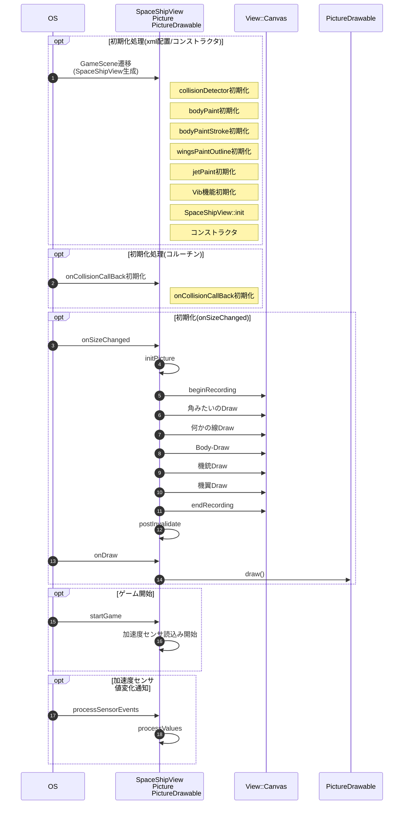
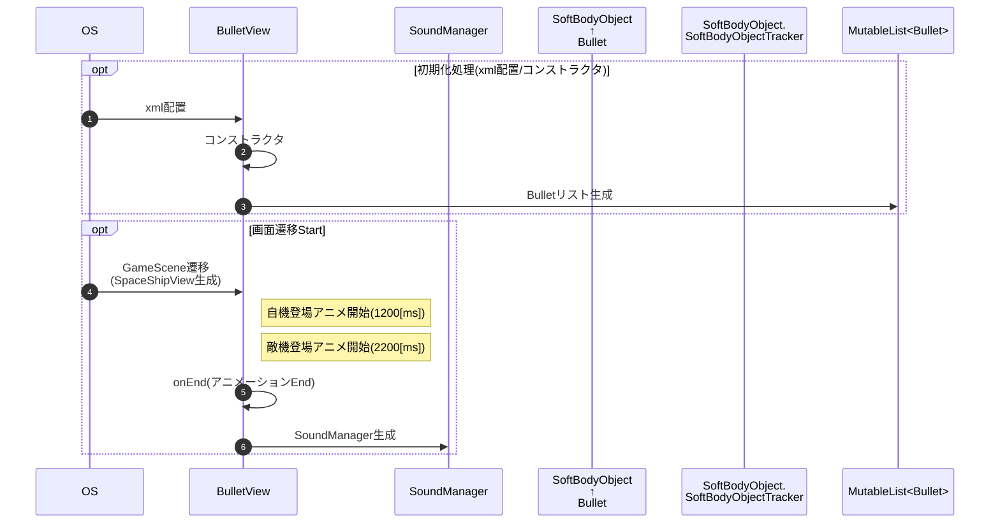
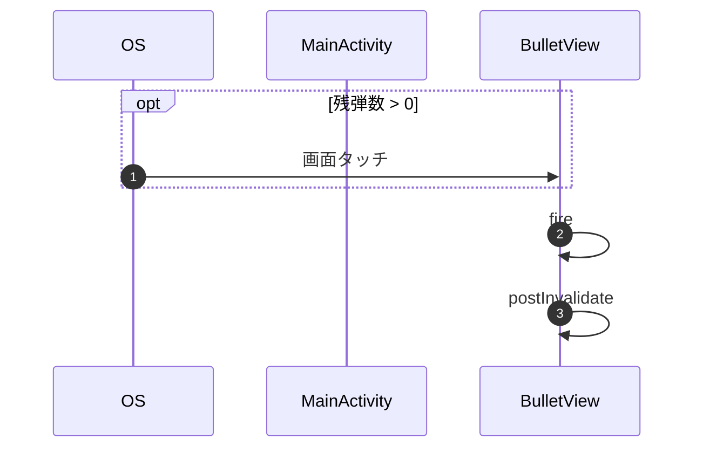
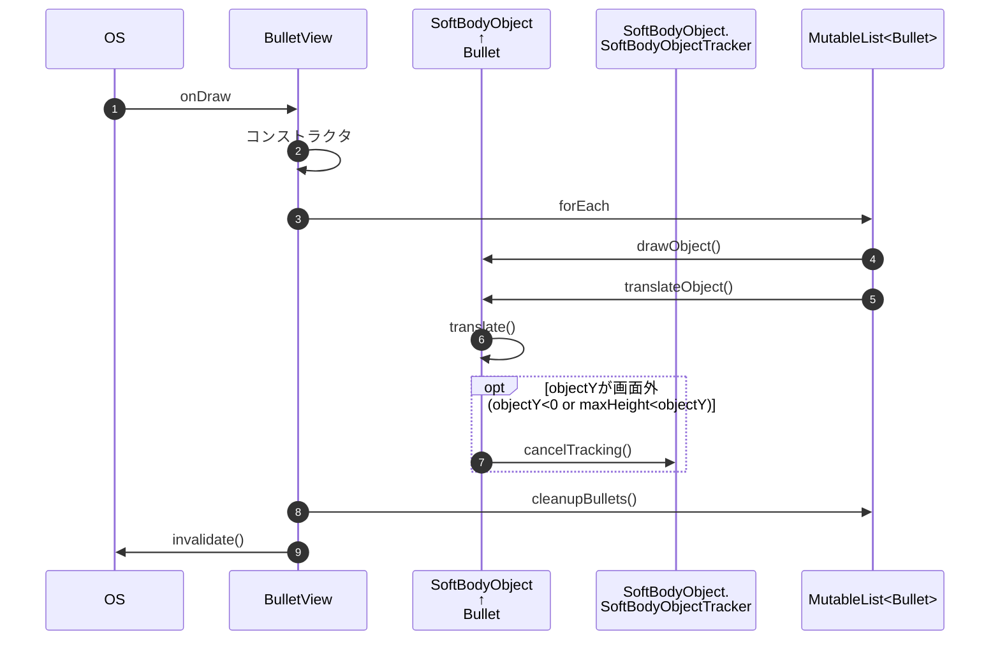
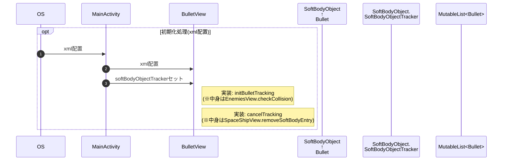
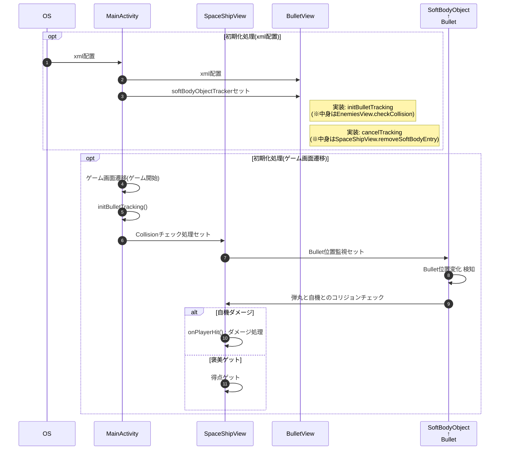

# AndKotlin-Invader
Android Kotlinで作成したInvaderゲーム

## GameSceneのシーケンス

### 1.SpaceShipViewのシーケンス

```mermaid
%% SpaceShipViewのシーケンス
sequenceDiagram
    autonumber
    participant OS
    participant SpaceShipView as SpaceShipView<br/>　Picture<br/>　　　　　PictureDrawable

opt 初期化処理(xml配置/コンストラクタ)
    OS->>SpaceShipView: GameScene遷移<br/>(SpaceShipView生成)
    Note right of SpaceShipView: collisionDetector初期化
    Note right of SpaceShipView: bodyPaint初期化
    Note right of SpaceShipView: bodyPaintStroke初期化
    Note right of SpaceShipView: wingsPaintOutline初期化
    Note right of SpaceShipView: jetPaint初期化
    Note right of SpaceShipView: Vib機能初期化
    Note right of SpaceShipView: SpaceShipView::init
    Note right of SpaceShipView: コンストラクタ
end

opt 初期化処理(コルーチン)
    OS->>SpaceShipView: onCollisionCallBack初期化
    Note right of SpaceShipView: onCollisionCallBack初期化
end

opt 初期化(onSizeChanged)
    autonumber
    participant OS
    participant SpaceShipView
    participant ViewCanvas as View::Canvas
    OS->>SpaceShipView: onSizeChanged
    SpaceShipView->>SpaceShipView: initPicture
    SpaceShipView->>ViewCanvas: beginRecording
    SpaceShipView->>ViewCanvas: 角みたいのDraw
    SpaceShipView->>ViewCanvas: 何かの線Draw
    SpaceShipView->>ViewCanvas: Body-Draw
    SpaceShipView->>ViewCanvas: 機銃Draw
    SpaceShipView->>ViewCanvas: 機翼Draw
    SpaceShipView->>ViewCanvas: endRecording
    SpaceShipView->>SpaceShipView: postInvalidate
    OS->>SpaceShipView: onDraw
    SpaceShipView->>PictureDrawable: draw()
end
opt ゲーム開始
    OS->>SpaceShipView: startGame
    SpaceShipView->>SpaceShipView: 加速度センサ読込み開始
end
opt 加速度センサ 値変化通知
    OS->>SpaceShipView: processSensorEvents
    SpaceShipView->>SpaceShipView: processValues
end

```

### BulletViewのシーケンス

#### 初期化

```mermaid
%% SpaceShipViewのシーケンス(初期化)
sequenceDiagram
    autonumber
    participant OS
    participant BulletView
    participant SoundManager
    participant Bullet as SoftBodyObject<br/>↑<br/>Bullet
    participant SoftBodyObjectTracker as SoftBodyObject.<br/>SoftBodyObjectTracker
    participant BulletList as MutableList<Bullet>

opt 初期化処理(xml配置/コンストラクタ)
    OS->>BulletView: xml配置
    BulletView->>BulletView: コンストラクタ
    BulletView->>BulletList: Bulletリスト生成
end

opt 画面遷移Start
    OS->>BulletView: GameScene遷移<br/>(SpaceShipView生成)
    Note right of BulletView: 自機登場アニメ開始(1200[ms])
    Note right of BulletView: 敵機登場アニメ開始(2200[ms])
    BulletView->>BulletView: onEnd(アニメーションEnd)
    BulletView->>SoundManager: SoundManager生成
end

```

#### fire

```mermaid
%% SpaceShipViewのシーケンス(fire)
sequenceDiagram
    autonumber
    participant OS
    participant MainActivity
    participant BulletView

    opt 残弾数 > 0
        OS->>BulletView: 画面タッチ
    end
    BulletView->>BulletView: fire
    BulletView->>BulletView: postInvalidate
```

#### onDraw

```mermaid
%% SpaceShipViewのシーケンス(onDraw)
sequenceDiagram
    autonumber
    participant OS
    participant BulletView
    participant Bullet as SoftBodyObject<br/>↑<br/>Bullet
    participant SoftBodyObjectTracker as SoftBodyObject.<br/>SoftBodyObjectTracker
    participant BulletList as MutableList<Bullet>

    OS->>BulletView: onDraw
    BulletView->>BulletView: コンストラクタ
    BulletView->>BulletList: forEach
    BulletList->>Bullet: drawObject()
    BulletList->>Bullet: translateObject()
    Bullet->>Bullet: translate()
    opt objectYが画面外<br/>(objectY<0 or maxHeight<objectY)
        Bullet->>SoftBodyObjectTracker: cancelTracking()
    end
    BulletView->>BulletList: cleanupBullets()
    BulletView->>OS: invalidate()
```

#### 当たり判定(SpaceShipView)

```mermaid
%% SpaceShipViewのシーケンス(当たり判定)
sequenceDiagram
    autonumber
    participant OS
    participant MainActivity
    participant BulletView
    participant Bullet as SoftBodyObject<br/>↑<br/>Bullet
    participant SoftBodyObjectTracker as SoftBodyObject.<br/>SoftBodyObjectTracker
    participant BulletList as MutableList<Bullet>

opt 初期化処理(xml配置)
    OS->>MainActivity: xml配置
    MainActivity->>BulletView: xml配置
    MainActivity->>BulletView: softBodyObjectTrackerセット
    Note right of BulletView: 実装: initBulletTracking<br/>(※中身はEnemiesView.checkCollision)
    Note right of BulletView: 実装: cancelTracking<br/>(※中身はSpaceShipView.removeSoftBodyEntry)
end

```

```mermaid
%% SpaceShipViewのシーケンス(当たり判定)
sequenceDiagram
    autonumber
    participant OS
    participant MainActivity
    participant SpaceShipView
    participant BulletView
    participant SoftBodyObject as SoftBodyObject<br/>↑<br/>Bullet

opt 初期化処理(xml配置)
    OS->>MainActivity: xml配置
    MainActivity->>BulletView: xml配置
    MainActivity->>BulletView: softBodyObjectTrackerセット
    Note right of BulletView: 実装: initBulletTracking<br/>(※中身はEnemiesView.checkCollision)
    Note right of BulletView: 実装: cancelTracking<br/>(※中身はSpaceShipView.removeSoftBodyEntry)
end

opt 初期化処理(ゲーム画面遷移)
    MainActivity->>MainActivity: ゲーム画面遷移(ゲーム開始)
    MainActivity->>MainActivity: initBulletTracking()
    MainActivity->>SpaceShipView: Collisionチェック処理セット
    SpaceShipView->>SoftBodyObject: Bullet位置監視セット
    SoftBodyObject->>SoftBodyObject: Bullet位置変化 検知
    SoftBodyObject->>SpaceShipView: 弾丸と自機とのコリジョンチェック
    alt 自機ダメージ
        SpaceShipView->>SpaceShipView: onPlayerHit() : ダメージ処理
    else 褒美ゲット
        SpaceShipView->>SpaceShipView: 得点ゲット
    end
end

```
